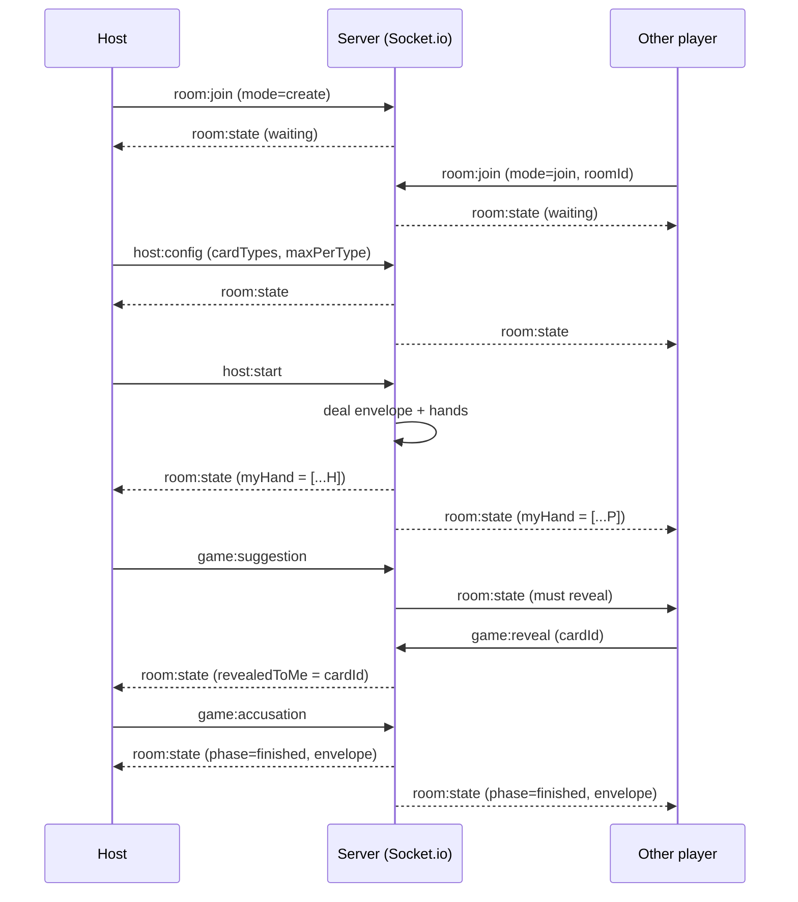

# Rick & Morty Cluedo

A friends-only web Cluedo-style game themed around Rick & Morty. Created rooms are never listed — the host shares a 6-character code, friends enter it, everyone hits Ready, and the engine deals cards. For 3-8 players. No commercial use — fan project only.

---

## Quick start

```bash
# 1. Install
npm install

# 2. Configure secrets
cp .env.local.example .env.local
# Edit .env.local and set APP_PASSWORD (the shared password your friends will type)
# and AUTH_SECRET (a long random string used to sign the session cookie).

# 3. Run dev
npm run dev
# Open http://localhost:3000
```

Build and run in production:

```bash
npm run build
npm start
```

The app uses a **custom Next.js server** (`server.js`) because Socket.io needs the underlying HTTP server. Always start the app via the `dev` / `start` scripts (which invoke `node --import tsx server.js`) — never `next dev` directly, or multiplayer won't work.

---

## How a game night goes

1. **Share the site URL and the `APP_PASSWORD` with your friends.**
2. Each friend visits the site and types the password on `/login`.
3. The room creator picks **Create room**, enters a display name, and lands in the waiting room with a **6-character code** (e.g. `K7M2QP`).
4. The creator texts that code to everyone.
5. Everyone else picks **Join room**, enters their name and the code.
6. The host configures the deck (card types and counts — see [Card types](#card-types)).
7. Every player presses **I'm Ready**.
8. The host clicks **Start game**. The engine:
   - draws one card of each selected type into the **Confidential Envelope** (the killer's identity),
   - deals the remaining cards round-robin so everyone has an equal (or ±1) hand.
9. Players take turns. On your turn you may **suggest** (forces one matching card to be secretly shown to you) or **accuse** (game-ending guess). Wrong accusation eliminates you.
10. First correct accusation wins. If everyone is eliminated, the killer escapes.

---

## Card types

The host chooses **at least 3** of these five card types per game, and how many of each are in the deck (smaller decks = easier; larger = harder).

| Type        | Question | Default |
|-------------|----------|---------|
| `person`    | Who      | 6       |
| `location`  | Where    | 6       |
| `weapon`    | How      | 5       |
| `motive`    | Why      | 4       |
| `time`      | When     | 5       |

All available names live in [`lib/cards.ts`](lib/cards.ts).

---

## Game rules (adapted Cluedo)

- **Players**: 3 to 8.
- **Goal**: Be the first to correctly identify every card in the Confidential Envelope.
- **Turn**:
  1. **Suggest** (optional): pick one card of each selected type. Each other player, in turn order, must secretly show you **one** card from your suggestion if they have any. They may pick which one to show if they hold several. The reveal is private — only you see it.
  2. **Accuse** (optional, game-ending): pick one card of each selected type. If it matches the envelope, you win. If not, you are eliminated.
  3. **End turn**: passes to the next non-eliminated player.
- **Suggestions** update the suggester's **Detective Notepad** with any card revealed.
- **Eliminated** players can still see the game and the log, but cannot act.
- **End of game**: someone accuses correctly, OR fewer than two non-eliminated players remain.

> Simplification vs. board-game Cluedo: there is no movement around a board and no dice. The web game focuses purely on the deduction flow.

---

## Architecture

```
Next.js 14 (App Router) + TypeScript
├── server.js            Custom Node HTTP server hosting both Next and Socket.io
├── lib/
│   ├── types.ts         Shared types (GameState, ClientGameState, CardDef, ...)
│   ├── cards.ts         Default card pool with image paths
│   ├── engine.ts        Pure game logic (deal, suggest, reveal, accuse, ...)
│   ├── store.ts         In-memory room store + helpers
│   ├── auth.ts          HMAC-signed cookie helpers (Node runtime)
│   ├── auth-shared.ts   Edge-safe constant (cookie name)
│   └── socket.ts        Socket.io server singleton + event handlers
├── middleware.ts        Redirects unauthenticated users to /login
├── app/
│   ├── login/           Shared-password gate
│   ├── lobby/           Create or join room
│   ├── room/waiting/    Socket bootstrap, then redirects to /room/[id]
│   ├── room/[id]/       WaitingRoom + GameBoard
│   └── api/login/       POST password -> sets cookie
└── components/          Reusable Card, Modal
```

### Real-time flow



### State management

All state lives **in memory on the server** in a `Map<roomId, GameState>` (see [`lib/store.ts`](lib/store.ts)). Restarting the server wipes every room — by design, for a friends-only project.

The server **never sends** any player's hand to anyone else. Each socket receives a `ClientGameState` view that includes only its own `myHand` and the cards revealed specifically to it.

---

## Image generation checklist

All card art lives under [`public/placeholders/`](public/placeholders/). Files do not exist yet — the `Card` component shows a colored gradient with the card name as fallback. When you generate images, save them at these exact paths (PNG, 3:4 portrait aspect recommended, e.g. 600x800).

> Slug rule: lowercase the card name, drop apostrophes, replace non-alphanumerics with hyphens, no leading/trailing hyphen.

### UI

- `public/placeholders/ui/logo.png`
- `public/placeholders/ui/card-back.png`
- `public/placeholders/ui/envelope.png`
- `public/placeholders/ui/portal-green.png`

### Person (`/placeholders/persons/`)

| File                              | Card name             |
|-----------------------------------|-----------------------|
| `rick-sanchez.png`                | Rick Sanchez          |
| `morty-smith.png`                 | Morty Smith           |
| `summer-smith.png`                | Summer Smith          |
| `beth-smith.png`                  | Beth Smith            |
| `jerry-smith.png`                 | Jerry Smith           |
| `mr-poopybutthole.png`            | Mr. Poopybutthole     |
| `birdperson.png`                  | Birdperson            |
| `squanchy.png`                    | Squanchy              |
| `evil-morty.png`                  | Evil Morty            |
| `mr-meeseeks.png`                 | Mr. Meeseeks          |

### Location (`/placeholders/locations/`)

| File                              | Card name             |
|-----------------------------------|-----------------------|
| `smith-garage.png`                | Smith Garage          |
| `citadel-of-ricks.png`            | Citadel of Ricks      |
| `blips-and-chitz.png`             | Blips and Chitz       |
| `cromulon-planet.png`             | Cromulon Planet       |
| `bird-world.png`                  | Bird World            |
| `froopyland.png`                  | Froopyland            |
| `interdimensional-cable.png`      | Interdimensional Cable|
| `gazorpazorp.png`                 | Gazorpazorp           |

### Weapon (`/placeholders/weapons/`)

| File                              | Card name             |
|-----------------------------------|-----------------------|
| `portal-gun.png`                  | Portal Gun            |
| `plumbus.png`                     | Plumbus               |
| `meeseeks-box.png`                | Meeseeks Box          |
| `dark-matter-gun.png`             | Dark Matter Gun       |
| `snake-laser.png`                 | Snake Laser           |
| `neutrino-bomb.png`               | Neutrino Bomb         |
| `c-137-knife.png`                 | C-137 Knife           |

### Motive (`/placeholders/motives/`)

| File                              | Card name             |
|-----------------------------------|-----------------------|
| `revenge.png`                     | Revenge               |
| `pure-science.png`                | Pure Science          |
| `saving-family.png`               | Saving Family         |
| `galactic-federation-order.png`   | Galactic Federation Order |
| `drunk-power.png`                 | Drunk Power           |
| `existential-dread.png`           | Existential Dread     |

### Time (`/placeholders/times/`)

| File                              | Card name             |
|-----------------------------------|-----------------------|
| `portal-dawn.png`                 | Portal Dawn           |
| `cromulon-night.png`              | Cromulon Night        |
| `schroedingers-hour.png`          | Schroedinger's Hour   |
| `squanch-oclock.png`              | Squanch O'Clock       |
| `interdimensional-midnight.png`   | Interdimensional Midnight |

---

## Deployment notes

This app uses a custom Node server for Socket.io, so **Vercel won't work** (Vercel's serverless functions don't keep WebSocket connections alive). Use any host that runs a long-lived Node process:

- [Railway](https://railway.app)
- [Fly.io](https://fly.io)
- [Render](https://render.com)
- A small VPS (DigitalOcean, Hetzner, etc.)

Set `APP_PASSWORD` and `AUTH_SECRET` as environment variables on the host. The port is taken from `PORT` (defaults to 3000).

---

## Disclaimer

This is a fan project for personal use among friends. Rick and Morty is a trademark of Cartoon Network / Adult Swim. The project is non-commercial.
